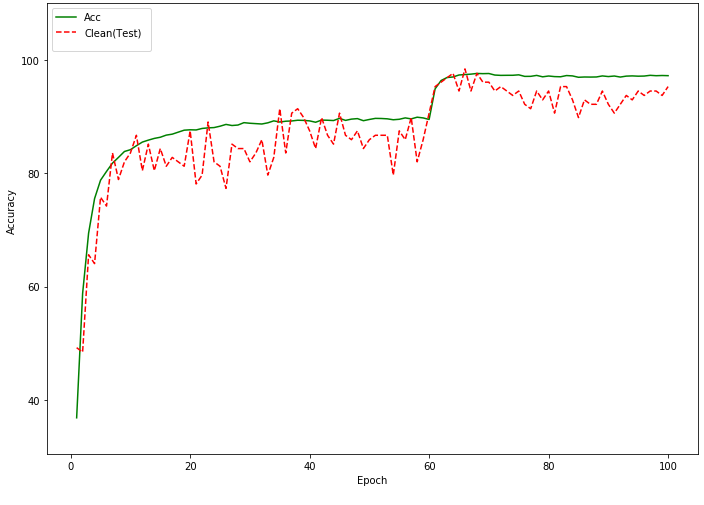

# Adversarial Robustess Stack
A descriptive anchor and stack for adversarial machine learning researchers

## Training
*base training*

## Attacks
We try to evaluate some popular attacks and distinguish different parameters which discussed more in the paper.

### *Linf* attacks
* MNIST dataset (Kaggle CNN model)

|       |   0.01   |   0.03   |   0.1   |   0.2   |   0.3   |
|-------|----------|----------|---------|---------|---------|
|  FGSM   |   98.44   |   96.51   |   73.56  |   23.59   |   **13.32**   |
|  PGD-50 |   **98.39**   |   **92.52**  |   8.25   |   0.24   |   0.10   |
|  FFGSM  |   98.42 |   96.42  |  **84.28**  |   **38.74**   |   12.03   |

* CIFAR10 dataset (WRN-28 model)

|       |   0.01   |   0.03   |   0.1   |   0.2   |   0.3   |
|-------|----------|----------|---------|---------|---------|
|  FGSM   |  24.03  |   11.44   |   10.59  |      |   **13.32**   |
|  PGD-50 |   **2.319**   |   0.00  | 0.00   |   0.00   |   0.00  |
|  FFGSM  |   34.94 |   20.30  |  7.90  |   5.63   |   3.91  |

### *L2* attacks
<table>
	<tbody>
		<tr>
			<td></td>
			<td colspan="2">
 <b> MNIST </b> 
</td>
			<td colspan="2">
 <b> CIFAR10 </b> 
</td>
		</tr>
		<tr>
			<td></td>
			<td>ACC</td>
			<td>Time (s)</td>
			<td>ACC</td>
			<td>Time (s)</td>
		</tr>
		<tr>
			<td>CW</td>
			<td>99.07</td>
			<td>6.47</td>
			<td>0.14</td>
			<td>805.78</td>
		</tr>
		<tr>
			<td>DeepFool</td>
			<td>30.40</td>
			<td>15375.4</td>
			<td>27.68</td>
			<td>46143.5</td>
		</tr>
	</tbody>

</table>

# Defenses
We try to focus on *Adversarial training* as a popular and useful method of defending against most adversarial settings. Also, we noted that the attack module in adversarial training is much more important and it is used as an attack-depended defense approach.

<table>
	<tbody>
		<tr>
			<td></td>
			<td colspan="4">
 <b> ACC </b> 
</td>
		</tr>
		<tr>
			<td></td>
			<td>-</td>
			<td>FGSM</td>
			<td>PGD</td>
			<td>FFGSM</td>
		</tr>
		<tr>
			<td>Base</td>
			<td><b>96.09</b></td>
			<td>11.44</td>
			<td>0.00</td>
			<td>20.30</td>
		</tr>
		<tr>
			<td>Adv-FGSM</td>
			<td>83.59</td>
			<td><b>99.11</b></td>
			<td>0.00</td>
			<td>25.54</td>
		</tr>
		<tr>
			<td>Adv-PGD</td>
			<td>91.40</td>
			<td>58.90</td>
			<td><b>49.22</b></td>
			<td><b>80.40</b></td>
		</tr>
		<tr>
			<td>Adv-FFGSM</td>
			<td>78.90</td>
			<td>95.86</td>
			<td>4.40</td>
			<td>4.40</td>
		</tr>
	</tbody>
</table>

[TBC]

* © <a href="http://limp.aut.ac.ir">LIMP</a> & <a href="http://ce.sdal.ce.aut.ac.ir">SDAL</a> laboratory
* © Amirkabir University of Technology
